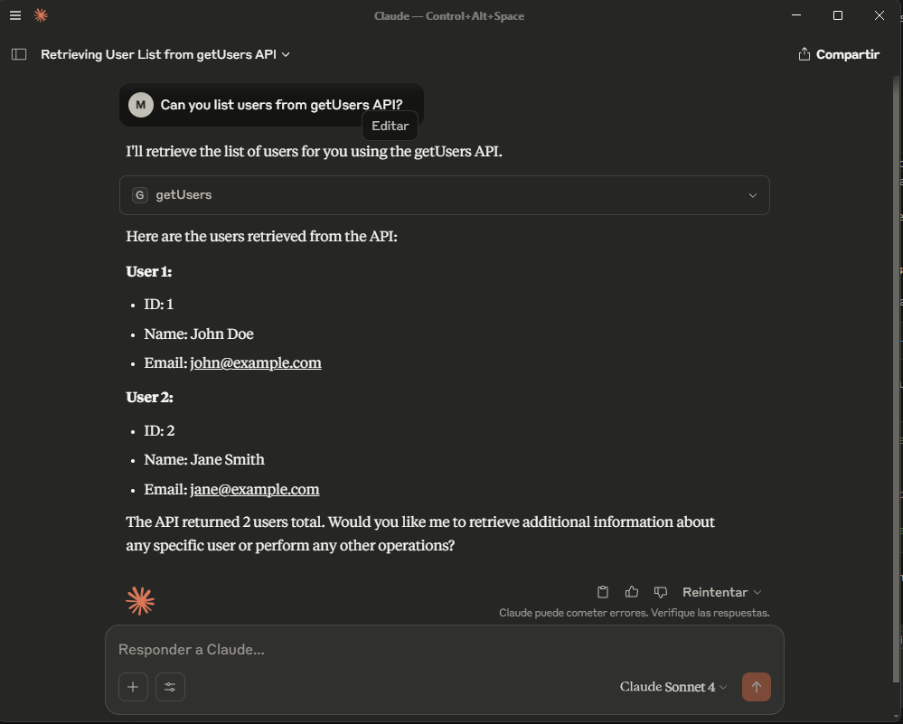

# MCP API Client (Beta)

A **Model Context Protocol (MCP) server** that **call APIs** using **YAML config** files. 

This server allows you connect to APIs using simple a config YAML file! 🤩

Ideal for: **`#lazy-programmers`** **`#nocode`** **`#lowcode`** **`#ai-integrators`** **`#automation`** **`#api-gateway`** **`#data-pipelines`** **`#rapid-prototyping`** **`#llm-integration`** **`#makers`**

If you don't have **advance APIs call skills** using a programming language or you just want  **a fast way to connect your AI model with an API** using MCP, you will LOVE 💖 this MCP.


## 🎬▶️ Example Video😉✨
[Check this video using included Test Server and Claude](https://www.berrycast.com/conversations/df10bb4d-a8f3-5331-aaf9-c923644959ae)

## Support with your Click!

Make a reaction and give me a motivational comment on [mcp.so repository](https://mcp.so/server/mcp-api-client/molavec?tab=comments)


... and yes! A donation to help cover my coffee and rent would be amazing! 🙏🙏

[](https://ko-fi.com/G2G1FR7OO)

### Features

- Configure multiple API endpoints using YAML
- Automatic MCP tool creation from YAML config file.
- Automatic MCP fetch API creation from YAML config file.
- Supports all HTTP methods (GET, POST, PATCH, PUT, DELETE) [✨PARTIAL✨]
  - [✅] GET API without parameters
  - [✅] GET API with query parameters
  - [✅] GET API with path parameters
  - [✅] POST API
  - [✅] PATCH API with path parameters
  - [✅] PUT API with
  - [✅] DELETE API with path parameters
  -
- Set API Headers [✨WORKING✨]
- Set API Token [✨ 🫣🔴COMMING SOON✨]
- Environment variable interpolation for sensitive data [✨ 🫣🔴COMMING SOON✨]
- Automatic PATH parameter detection from URL (like `/users/{id}`)[✨WORKING✨]
- Automatic QUERY parameter detection from URL (like `/users?page={page}&limit={limit}`) [✨WORKING✨]
- **Reduce Prompt tokens used** setting up certain APIs for your project
- ...and best of all, SAVE COUNTLESS HOURS FOR HUMANITY 👏😎😉 by connecting your LLM to any API.

### Use cases

- **Connect to N8N, Make.com or Zapier webhook**: Make actions in other platforms connecting to automations or integration tools.   
- **AI Model Integration**: Quickly connect LLMs or other AI models to external APIs for data retrieval, enrichment, or action execution without custom code.
- **Rapid Prototyping**: Build and test API workflows using YAML configuration, ideal for hackathons, demos, or proof-of-concept projects.
- **No-Code/Low-Code Automation**: Enable non-developers to define and call APIs securely using simple YAML files and environment variables.
- **Data Pipelines**: Orchestrate API calls as part of ETL or data processing pipelines, leveraging MCP tools for modularity and reuse.
- **API Gateway**: Expose multiple backend APIs through a unified MCP interface, simplifying integration for downstream consumers.
- **Secure API Access**: Manage secrets and tokens via environment variables, keeping sensitive data out of source code and YAML files.


<!-- ## How to use

```bash
npx -y mcp-api-client path-to-api-config-file.yaml
``` -->


## Getting started

1. Get a copy of default `api.yaml`.

```bash
npx -y mcp-api-client --init
```

2. You can test **default api.yaml** with express test server [test/server.js](https://github.com/molavec/mcp-api-client/blob/main/src/test/mock-api.ts). Execute in other terminal.

```bash
npx -y mcp-api-client --test-server
```


3. Add MCP to your agent config file. 

* Example for `Claude Client` settings file:

```json
"mcp": {
    "servers": {
      "mcp-api-client": {
          "command": "npx",
          "args": [
              "-y",
              "mcp-api-client",
              "path-to-api.yaml"
          ]
      },
    }
  }

```


* Example for `Visual Studio Code` settings file:

```json
"mcp": {
    "servers": {
      "mcp-api-client": {
          "command": "npx",
          "args": [
              "-y",
              "mcp-api-client",
              "path-to-api.yaml"
          ]
      },
    }
  }

```

4. Just Ask!




## YAML Configuration File

Each API YAML file can include global metadata  with MCP information:

```yaml
metadata: General information about the API set
```

and a list of API endpoint definitions:

```yaml
apis: A list of API endpoint definitions. Each endpoint should have
```

### Example API YAML config file example

```yaml
metadata:
  name: API Examples
  version: 1.0.0
  description: This file contains examples of various API endpoints for testing purposes.

apis:
  - name: getUser
    url: https://api.example.com/users/{id}
    method: GET
    content:
      headers:
        Accept: application/json
  
  - name: createUser
    url: https://api.example.com/users
    method: POST
    api-token: ${API_TOKEN}
    content:
      headers:
        Content-Type: application/json
      body:
        name: string
        email: string
  ...
```

See [public/apis.yaml](https://github.com/molavec/mcp-api-client/blob/main/public/apis.yaml) for a complete example with metadata and all HTTP methods and parameter types.


## API_TOKEN from .env (Not tested yet!)

Create a `.env` file for your API tokens:

```
API_TOKEN=your_api_token_here
``` 

## Bugs and Requests

https://github.com/molavec/mcp-api-client/issues

## Contributing

1. Fork the repository
2. Create your feature branch
3. Commit your changes
4. Push to the branch
5. Create a new Pull Request

## License
MIT
